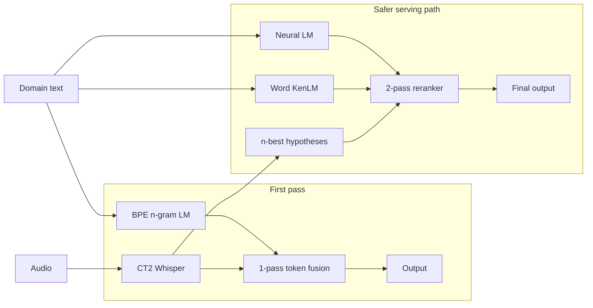
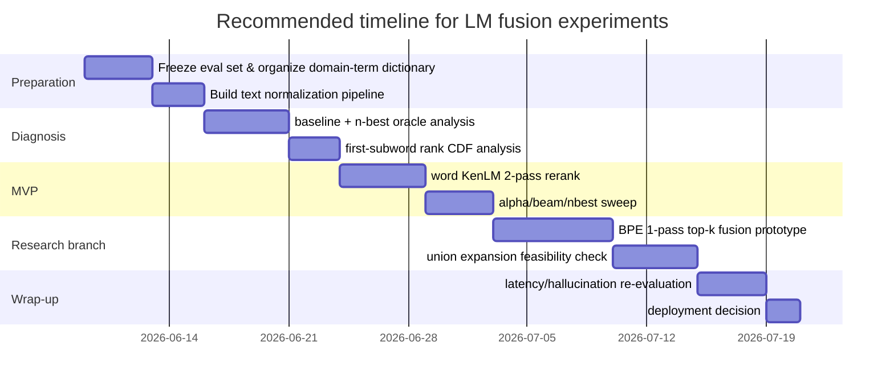

# Fusion Analysis of BPE Token LM and Word LM for Whisper Domain Adaptation on CT2

## Executive Summary

**What LM fusion is**
- Adds a language prior that lives **outside the model** to the decoding scores.
- Does **not** modify the model architecture; it just combines an external LM's scores with the decoder scores.
- This report analyzes how to apply such fusion to Whisper (on CT2) for domain adaptation, comparing a **BPE token LM** vs a **word LM**.

**Bottom line: the realistic MVP is a word-level KenLM 2-pass n-best rerank.** Three reasons:
- The CT2/Whisper API supports beam size, `num_hypotheses`, and score return — but has **no documented hook** to inject external LM scores at each beam-search step.
- faster-whisper calls CT2 `generate` internally but **uses only the first hypothesis**, so n-best needs raw CT2 or a wrapper patch.
- The text `Generator` callback works **only at `beam_size=1`**, not beam search — and the Whisper API lacks even that.
- → "1-pass LM fusion" is in practice **a CT2 C++ decoder fork project**.

**BPE LM vs word LM are not substitutes — their roles differ.**
- **BPE LM**: same token granularity as Whisper → can influence from the **first subword**.
- **Word LM**: stable terminology prior at the Korean eojeol/word level, but boundary-only online fusion **can't score until the word ends** → doesn't directly solve "first-token entry."
- Korean has multiple eojeol↔morpheme granularities and ordinary BPE doesn't fit its morphology well → a word LM is strong for **reranking**, weaker than expected for **1-pass first-token rescue**.

**Rescoring only the ASR top-k is inherently limited.**
- Shallow fusion is repeatedly proven in seq2seq ASR, but if the correct first token is **already pruned** out of the ASR shortlist, the LM can't revive it.
- This is why iterative/delayed fusion work treats "early pruning" and "tokenization mismatch" separately.
- → top-k-only fusion is **strong only within the pruning boundary**.

**Practical recommendation: do an n-best oracle analysis first.**
- Correct domain terms often inside the n-best → **word LM rerank** has the best ROI.
- Correct terms rarely in the n-best → need **beam expansion** or a **1-pass token-level fusion research branch** first.
- Union-candidate expansion beats top-k-only in theory, but on CT2 the implementation difficulty rises sharply.

| Option | Expected effect | CT2 difficulty | Latency impact | MVP suitability |
|---|---|---:|---:|---:|
| BPE token LM 1-pass top-k fusion | Can intervene on the first subword, but cannot revive anything outside the shortlist | High | Medium | Low |
| BPE token LM union expansion | Highest chance of first-token rescue | Very high | High | Low |
| Word LM 1-pass boundary fusion | Stable for Korean domain terms, but weak first-token influence | Very high | Medium–high | Low |
| Word LM 2-pass n-best rerank | High potential to improve term recall, simple to implement | Low–medium | Low | Highest |
| Neural LM 2-pass rerank | High quality potential, increased cost and operational complexity | Medium | Medium | Experimental |

## Theory and Complexity

**Shallow fusion = log-linear interpolation of ASR + external LM scores.** A proven fundamental, not an old idea:
- Google attention-based seq2seq ASR, wordpiece neural LM shallow fusion → **9.1% relative WERR**.
- Multilingual LLM shallow fusion → average **5.53% WER reduction, up to 10%**.
- What governs actual performance: **which unit, at which time, over which candidate set** the score is computed.

BPE token-granularity score fusion:

```text
S(y1:t) = Σi log P_ASR(yi | x, y<i)
        + α Σi log P_LM(yi | y<i)
        + β · LP(y1:t)
```

`LP` is a length-penalty-type correction. Step-wise, the incremental score of a new candidate token `v`:

```text
Δ(v | h_t) = log P_ASR(v | x, h_t)
           + α log P_LM(v | h_t)
           + β ΔLP
```

- **Key point**: a BPE LM with the same tokenizer can add a score **from the first subword**. Whether `보장개시일` starts with `보…` or another segmentation path, if it's in the current beam candidate set the prior intervenes immediately. → biggest advantage of a BPE LM.

Attaching a **word LM online** requires handling the completed word sequence and the unfinished buffer separately. Simplest boundary-only form:

```text
Δ(v | h_t) = log P_ASR(v | x, h_t)
           + α · 1[word boundary closes after v]
             · log P_WLM(w_new | W(h_t))
```

- `W(h_t)` = words completed so far; `w_new` = the word completed when the boundary closes this step.
- **Meaning**: the word LM **can't score until the word is complete**. For Korean terms spanning one long eojeol, plain online fusion kicks in late.
- → The intuition "a word LM captures meaning, so it'll fix the first-token problem too" often fails once you look at **when the boundary closes**.

For a word LM to influence the first token, you need extra structure like **prefix-mass scoring** — precompute, for a partial buffer `u`:

```text
ψ(u | W) = log Σ_{w startswith u} P_WLM(w | W)
```

and add this prefix mass as a reward before the word ends.
- Sound in theory, but in practice needs a **lexical trie + prefix-mass cache + LM state coupling**.
- Plain KenLM doesn't naturally support "top next-words given a prefix" → it becomes a **custom decoder engineering** problem. KenLM is fast precisely because it's optimized for "scoring a requested n-gram" (trie/probing query, binary mmap, estimation/filtering).

**Korean makes this worse:**
- Whisper uses a deterministic `tiktoken` tokenizer; Korean has multiple eojeol↔morpheme granularities, and raw BPE may not reflect morphology well.
- Korean NLP: morpheme-aware subword tokenization can beat standard BPE.
- Multilingual ASR: UTF-8 byte-level BPE lengthens token sequences for CJK → more decode iterations/compute.
- → Trade-off is sharp in Korean: **BPE LM = good unit consistency, word LM = good semantic-unit stability.**

**Candidate-set view:** with correct next token `y*` and candidate set `C_t`, recovery at that step is upper-bounded by `y* ∈ C_t`. This explains the top-k-only vs union gap — shallow fusion works, but **early pruning** and **tokenization mismatch** need separate design.

| Method | Candidate set | Extra LM cost | First-token rescue chance | Notes |
|---|---|---:|---|---|
| top-k only | `C_t = TopK_ASR(K_a)` | `O(T·B·K_a)` | Low | Fails if the answer is outside the ASR shortlist |
| union expansion | `C_t = TopK_ASR(K_a) ∪ TopK_LM(K_l)` | Ideally `O(T·B·(K_a+K_l))`, plus the actual cost of extracting LM top-k | Medium–high | Requires an LM shortlist generator |
| full-vocab fusion | `C_t = V` | `O(T·B·|V|)` | Highest | Slowest; heavy burden for CT2 1-pass |

- `T` = decode steps, `B` = beam size, `|V|` = Whisper subword vocab size.
- **top-k-only** = cheap but pruning-limited; **union** = balanced but hard to implement; **full-vocab** = strongest but not server-friendly.

## Real-World Effect and Failure Modes

**Effect appears first in domain-term recall, not overall CER/WER.**
- seq2seq ASR + external LM has prior overall-WER wins; rare-word evidence is more direct (unigram shallow fusion → **3.7% relative WER improvement** on RNN-T rare words, no harm to the general set).
- In long-tail domains (insurance/medical/legal), expect bigger gains on critical terms like `후유장해`, `보장개시일`, `치주질환` than on a few points of overall CER.

**Where each LM excels:**
- **BPE LM** — short phrases, first-subword entry, exact-unit fusion with Whisper. Wins when the correct first token enters ASR top-16 but ranks ~8–16 and gets pruned every time → token-level score can flip beam survival.
- **Word LM** — compound nouns, spacing variation, spelling-stable domain words. Often more robust in reranking for Korean.

**Key caveat: word LM is strong at 2-pass rerank, NOT automatically at 1-pass first-token rescue.**
- Many Korean domain terms attach as a single eojeol without spaces → boundary-only fusion works only "after the word ends."
- Once the first-character contention in `보장개시일` is over, the word LM can do nothing; a BPE LM splits the surface into subwords and acts each step.
- → Natural division of labor: **word rerank for the serving MVP, BPE 1-pass for first-token rescue research.**

**Hallucination risk differs by method:**
- Stronger text prior → more pressure to complete "plausible text," especially on short/weak-acoustic spans.
- Hallucination/repetition is a known Whisper long-form problem, especially pronounced on short segments.
- BPE token-level online fusion usually carries **more** risk than word rerank (prior accumulates every subword step) → as α grows, watch insertions and hallucination together.

**top-k-only's limit is revealed by oracle analysis:**
- Reference first subtoken usually in ASR ranks 1–8 → top-k-only BPE fusion can work.
- Frequently outside top-32 → token-level top-k fusion stalls near a learned sequence bias.
- Reference term often in 5-best/10-best → 2-pass word LM delivers value at much lower cost.
- → Choose **online first-pass vs offline rerank by oracle recall, not by gut feeling.**

| Scenario | BPE token LM | Word LM 1-pass | Word LM 2-pass |
|---|---|---|---|
| First subword of short domain phrases is often confused | Best fit | Weak | Indirect |
| Long Korean compound-noun/eojeol domain terms | Moderate | Late if boundary-only | Strong |
| Many spacing/notation variants | May be fragile | Moderate | Strong |
| Answer is often within the n-best | Usable | Overkill | Optimal |
| Answer rarely even in the n-best | Worth researching | Not recommended | Limited effect |

## CT2 Integration and Serving Cost

**Four architecture options:**
1. CT2 Whisper internal **1-pass token-level fusion**
2. CT2 Whisper **n-best + external LM rerank**
3. Word-level **delayed/boundary fusion**
4. **Separate neural LM service** or CT2 Generator rerank

- raw CT2 supports beam search, `num_hypotheses`, `return_scores`, `return_logits_vocab` → enough hooks for analysis/experiments.
- faster-whisper is convenient for production but uses only the first hypothesis → constrained for n-best experiments.



**Official API constraints:**
- `generate(..., beam_size, num_hypotheses, return_scores, return_logits_vocab, suppress_tokens ...)` exists, but **no documented per-step external-scorer callback** in Whisper beam search.
- The text `Generator` callback is meaningful only in **`beam_size=1` token streaming**, incompatible with beam search.
- → "1-pass LM fusion that plugs naturally into CT2" is **not an official option — it's a decoder fork.**

**Wrapper level (faster-whisper):**
- `TranscriptionOptions` has `beam_size`, `best_of`, `initial_prompt`, `prefix`, `hotwords`; calls `self.model.model.generate(...)` with `return_scores=True`.
- But it reads only `result.sequences_ids[0]` → **CT2 core can produce n-best, the wrapper is 1-best oriented.**
- `hotwords` is a prompt-construction hint, **not** LM fusion.
- → For 2-pass rerank, use raw `ctranslate2.models.Whisper` or patch faster-whisper to surface all hypotheses.

| Implementation path | CT2 compatibility | Scope of change | Operational difficulty | Notes |
|---|---|---:|---:|---|
| raw CT2 Whisper + word KenLM rerank | High | Python service layer | Low | Recommended MVP |
| faster-whisper patch + n-best rerank | High | Python wrapper | Low–medium | Can reuse existing code |
| BPE LM fusion in CT2 C++ beam search | Medium | C++ core | High | True 1-pass |
| CT2 C++ + union expansion | Low–medium | C++ core + LM index | Very high | Research task |
| external neural LM server rerank | High | Separate service | Medium | Suitable for batch scoring |

**Cost, quantified** (`T` decode steps, `B` beam, `K` ASR shortlist):
- 1-pass top-k token fusion ≈ `T·B·K` LM queries. e.g. `T=80, B=5, K=32` → **~12,800 queries/utterance**.
- 2-pass 10-best word rerank ≈ **~200 word queries** (≈20 words × 10 candidates), and keeps the CT2 batching path almost intact.
- full-vocab token fusion = `T·B·|V|` → effectively expensive for a tens-of-thousands Whisper vocab.
- → This is why 2-pass is examined first. (Numbers illustrative; the complexity gap is structural.)

**KenLM memory options:**
- **probing** = faster, more memory; **trie** = less memory, slightly slower; binary format supports `mmap`.
- Tight server memory → **trie + binarized + mmap**; latency-critical → **probing**.
- Pairs well with CT2: Whisper on GPU, word LM as a CPU memory-mapped sidecar.

**Performance risk** = how much it breaks the existing fast path, not "does it run":
- Python-level per-step fusion on top of faster-whisper's batched FP16/INT8 / CPU INT8 paths can lose much of the batching benefit.
- 2-pass rerank leaves decoding intact and only post-processes → much smaller throughput hit.

**Deployment constraint:** latest `ctranslate2` requires **CUDA 12 + cuDNN 9**. If already stable, raw CT2 is fine; if the wrapper/container is locked in, a Python-layer 2-pass is far safer than a C++ fork.

## Experiment Design

**First principle: change only the text-only prior, create no new audio.** Three data layers:
- Real domain **audio eval set**
- Domain **text corpus** — three size brackets (1k / 10k / 100k sentences); chase **source diversity**, not just count (policy terms / product descriptions / FAQs / consultation logs / case-law summaries). A dominant template → "document-style overfitting," not domain adaptation.
- Domain-term **lexicon**

**LM variants — compare at least four:** BPE 3-gram, BPE 5-gram, word KenLM 3-gram, word KenLM 5-gram.
- BPE LM **must** use the **same tokenizer** as Whisper (good reproducibility via deterministic `tiktoken`).
- Word LM: prepare a **raw eojeol** version and a **normalized** version (unify numbers / English caps / brand codes / spacing). Optionally keep the lexicon as a separate prefix trie. Preprocessing quality matters more here.

**Evaluation order: oracle → rerank → 1-pass.**
- Extract n-best (beam 5/10/20, hypotheses 5/10/20) and check whether reference terms are inside → **n-best oracle term recall**.
- High 10-best oracle recall → 2-pass rerank alone suffices.
- Low oracle recall → rerank isn't the fix; move to beam expansion or 1-pass token fusion.
- `num_hypotheses` makes this possible at the raw CT2 level.

**Core metrics — CER/WER alone is insufficient.** Watch five axes:
- CER or WER, **domain-term recall**, **domain-term precision**, **insertion rate**, **hallucination rate**.
- Measure hallucination separately on **silence / short utterances / no-domain-term segments**; short-segment hallucination is a distinct problem.

**Speed metrics:** p50/p95 latency, GPU utilization, CPU time, LM query count.
- 1-pass fusion lets a CPU LM intrude into the GPU loop → plain wall-clock hides the cause.
- 2-pass cleanly separates Whisper decode time vs LM rerank time; watch the **LM time / total time** ratio (KenLM attaches stably as a CPU mmap binary).

| Item | Recommended grid |
|---|---|
| beam size | 5, 10, 20 |
| n-best | 5, 10, 20 |
| BPE LM order | 3, 5 |
| word LM order | 3, 5 |
| α | 0.05, 0.1, 0.2, 0.4, 0.8 |
| shortlist `K_a` | 8, 16, 32, 64 |
| union `K_l` | 8, 16 |
| text size | 1k, 10k, 100k sentences |
| eval-set split | all / short utterances / near-silence / contains domain terms |

**Decide the BPE 1-pass branch by the rank CDF** of the reference's first correct subword in the ASR logits:
- Mostly within top-16 → top-k-only fusion has a good chance.
- Mostly 17–64 → union is meaningful.
- Often outside top-64 → prioritize **acoustic/model-side adaptation** over an external LM.
- `return_logits_vocab=True` enables this on a small set, but its memory burden means **analysis-only**.



## Recommendations

**Sequencing:** start the serving-aware MVP with a **word-level KenLM 2-pass n-best rerank**; raise **BPE token-level 1-pass fusion as a research branch only after the oracle confirms first-token rescue is the real bottleneck.**
- Experiments run immediately without touching the CT2 core.
- Fits the Korean-domain-term essence — compounds, spacing, notation stability.
- raw CT2 supports `num_hypotheses`; KenLM attaches easily via trie/probing + mmap.

**Decide the criterion mechanically by oracle:**
- `10-best oracle term recall ≥ 85%` → start with word rerank.
- Recall high but overall CER barely moves → add a **domain-term weighted rerank score** rather than re-tuning α.
- `< 70%` → look at beam expansion / 1-pass token fusion before rerank; first check the **first-subword rank CDF** to see if `top-k-only` is feasible (don't jump to union).

**BPE vs word — pick by what you want to improve:**
- **First-subword survival** is the crux → BPE.
- **Stability of completed domain words/compounds** is the crux → word.
- Korean is usually the latter → word rerank for deployment, BPE 1-pass kept as a targeted reinforcement only where leading characters are often wrong and term entry itself fails. Least risky division of labor given Korean granularity + BPE limits.

**top-k-only vs union:**
- MVP → skip top-k-only entirely, **start from 2-pass**.
- Research branch → **BPE token LM only**, in order top-k-only → union.
- Why: union's theory is clear, but LM top-k candidate generation is feasible for a BPE LM and **not clean for a word KenLM** (needs prefix mass / lexical trie). So word-level union has poor payoff; BPE union is research-worthy but needs C++ decoder changes to be CT2-friendly.

**Recommended roadmap (three tracks):**
- **Deployment:** raw CT2 / patched faster-whisper → n-best → word KenLM 2-pass rerank.
- **Analysis:** quantify first-subword misses with `return_logits_vocab` + n-best oracle.
- **Research:** if that miss is genuinely large, put a BPE 5-gram token LM into C++ beam search for shortlist fusion.
- → Verifies "will it work" and "is it servable" simultaneously, at the lowest risk.
