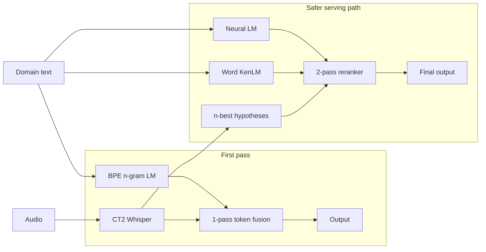
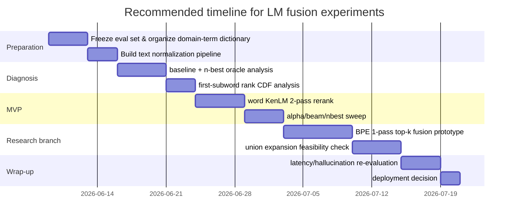

# Fusion Analysis of BPE Token LM and Word LM for Whisper Domain Adaptation on CT2

## Executive Summary

**LM fusion** adds a language prior that lives **outside the model** to the decoding scores. Rather than modifying the model architecture, it injects a domain prior by combining an external LM's scores with the decoder scores. This report analyzes how to apply such fusion to Whisper (on CT2) for domain adaptation, comparing a BPE token LM and a word LM.

To state the conclusion up front, **a word-level KenLM 2-pass n-best rerank is the most realistic MVP once serving is taken into account**. There are three reasons. First, the CTranslate2/Whisper official API supports beam size, `num_hypotheses`, and returning scores, but there is no documented official hook for injecting external LM scores at every step inside Whisper's beam search. Second, the faster-whisper wrapper internally calls CT2 `generate` but consumes only the first hypothesis from the result, so using n-best requires using raw CT2 directly or patching the wrapper. Third, the callback on the official text `Generator` works only when `beam_size=1`, not under beam search, and the Whisper API does not even have that. Therefore "1-pass LM fusion" is in practice **a CT2 C++ decoder fork project**.

In terms of effect as well, **a BPE token LM and a word LM are not substitutes for each other; their roles differ.** A BPE LM scores at the same token granularity as Whisper, so in theory it can exert influence from the very first subword. A word LM, on the other hand, is better for a stable terminology prior at the Korean eojeol/word level, but if implemented as **online boundary-only fusion**, it often cannot assign a score until the word ends, so it does not directly solve the "first-token entry" problem. Because Korean has multiple segmentation granularities between eojeol and morpheme, and ordinary BPE does not necessarily fit Korean morphology well, a word LM can be strong for **reranking** but weaker than expected for **1-pass first-token rescue**.

Another important conclusion is that **rescoring only the ASR top-k is inherently limited.** Shallow fusion itself has been repeatedly reported to be effective in seq2seq ASR, but if the correct first token has already been pruned out of the ASR shortlist, the LM cannot revive that token. This is exactly why recent iterative/delayed fusion lines of work treat "early pruning" and "tokenization mismatch" as separate concerns. That is, "top-k-only token fusion" is a more generalized learned prior than a fixed sequence bias, but it is **a method that is strong only within the pruning boundary**.

The practical recommendation is clear. **First do an n-best oracle analysis.** If the correct domain terms frequently appear within the n-best, word LM rerank has the best ROI. Conversely, if the correct terms rarely appear even in the n-best, then before rerank you need **beam expansion** or a **1-pass token-level fusion research branch**. Even then, union-candidate expansion is in theory better than top-k-only, but on CT2 the implementation difficulty rises sharply.

| Option | Expected effect | CT2 difficulty | Latency impact | MVP suitability |
|---|---|---:|---:|---:|
| BPE token LM 1-pass top-k fusion | Can intervene on the first subword, but cannot revive anything outside the shortlist | High | Medium | Low |
| BPE token LM union expansion | Highest chance of first-token rescue | Very high | High | Low |
| Word LM 1-pass boundary fusion | Stable for Korean domain terms, but weak first-token influence | Very high | Medium–high | Low |
| Word LM 2-pass n-best rerank | High potential to improve term recall, simple to implement | Low–medium | Low | Highest |
| Neural LM 2-pass rerank | High quality potential, increased cost and operational complexity | Medium | Medium | Experimental |

## Theory and Complexity

The standard form of shallow fusion is a **log-linear interpolation** of the ASR score and the external LM score. In seq2seq ASR this is not an old idea but a proven fundamental; in Google's attention-based seq2seq ASR, wordpiece neural LM shallow fusion reported a **9.1% relative WERR**. Later, multilingual LLM shallow fusion also reported an average 5.53% WER reduction, up to a 10% reduction. So "injecting a text prior at decode time" is an idea already confirmed to work under various conditions. That said, **which unit, at which point in time, and over which candidate set** the score is computed is what governs actual performance.

For a BPE token granularity, the score fusion can be written as follows.

```text
S(y1:t) = Σi log P_ASR(yi | x, y<i)
        + α Σi log P_LM(yi | y<i)
        + β · LP(y1:t)
```

Here `LP` is a length-penalty-type correction term. Step-wise, the incremental score of a new candidate token `v` is as follows.

```text
Δ(v | h_t) = log P_ASR(v | x, h_t)
           + α log P_LM(v | h_t)
           + β ΔLP
```

The key point of this expression is that **a BPE LM that uses the same tokenizer can add a score starting from the first subword**. That is, whether the first subword of `보장개시일` starts with `보…` or with a different segmentation path, as long as it is within the current beam candidate set, the LM prior can intervene from that moment. This is the biggest advantage of a BPE LM.

By contrast, attaching a word LM to Whisper BPE decoding **online** requires handling the completed word sequence and the unfinished buffer separately. The simplest boundary-only form can be written as follows.

```text
Δ(v | h_t) = log P_ASR(v | x, h_t)
           + α · 1[word boundary closes after v]
             · log P_WLM(w_new | W(h_t))
```

Here `W(h_t)` is the sequence of words completed so far, and `w_new` is the new word completed when the boundary closes at this step. What this formula means is clear: **the word LM cannot assign a score until the word is complete.** When a Korean domain term spans a long stretch within a single eojeol, plain word-level online fusion kicks in later than expected. So the intuition that "since a word LM captures word meaning well, it will also solve the first-token problem" often does not hold once you look mathematically at **the moment the boundary closes**.

For a word LM to also influence the first token, additional structure such as **prefix-mass scoring** is needed. For example, for a partial buffer `u`, precompute

```text
ψ(u | W) = log Σ_{w startswith u} P_WLM(w | W)
```

and add this prefix mass as a reward even before the word ends. This makes sense in theory, but in practice it requires a **lexical trie + prefix-mass cache + LM state coupling**. Because a plain KenLM query does not naturally support "drawing the top next-words from a given prefix," from this point on it effectively turns into a **custom decoder engineering** problem. The reason KenLM is fast is fundamentally that it is optimized for "scoring a requested n-gram"; its design centers on trie/probing query, binary mmap, and estimation/filtering.

In Korean this problem grows larger. The public Whisper implementation uses a deterministic `tiktoken`-based tokenizer, but Korean has multiple coexisting segmentation granularities between eojeol and morpheme, and applying BPE as-is may not sufficiently reflect morphology. Korean NLP research points out that the segmentation granularity between eojeol and morpheme can have several levels, and that morpheme-aware subword tokenization can give better properties than standard BPE. Also, from a multilingual ASR perspective, UTF-8 byte-level BPE lengthens token sequences for CJK scripts like Korean, increasing decoding iterations and computation. In short, the trade-off that **a BPE LM has good unit consistency while a word LM has good semantic-unit stability** is especially sharp in Korean.

From a candidate-set perspective the difference becomes even clearer. Letting the correct next token be `y*` and the candidate set be `C_t`, the chance of recovery at that step is fundamentally upper-bounded by `y* ∈ C_t`. This fact explains the difference between top-k-only and union: while shallow fusion itself is effective, separate design is needed because of **early pruning** and **tokenization mismatch**.

Below are the differences among three candidate-expansion methods that matter in practice.

| Method | Candidate set | Extra LM cost | First-token rescue chance | Notes |
|---|---|---:|---|---|
| top-k only | `C_t = TopK_ASR(K_a)` | `O(T·B·K_a)` | Low | Fails if the answer is outside the ASR shortlist |
| union expansion | `C_t = TopK_ASR(K_a) ∪ TopK_LM(K_l)` | Ideally `O(T·B·(K_a+K_l))`, plus the actual cost of extracting LM top-k | Medium–high | Requires an LM shortlist generator |
| full-vocab fusion | `C_t = V` | `O(T·B·|V|)` | Highest | Slowest; heavy burden for CT2 1-pass |

Here `T` is the number of decode steps, `B` is the beam size, and `|V|` is the size of the Whisper subword vocabulary. The core point is simple: **top-k-only is cheap but pruning-limited**, **union is theoretically well-balanced but hard to implement**, and **full-vocab is strongest but not server-friendly**. This conclusion aligns well with the problem framing of shallow fusion, delayed fusion, and iterative fusion.

## Real-World Effect and Failure Modes

Stated without exaggeration, **the effect is likely to appear first in "domain-term recall" rather than in overall CER/WER**. seq2seq ASR + external LM already has prior cases of overall WER improvement, and for rare words there is much more direct evidence: unigram shallow fusion showed a **3.7% relative WER improvement** on RNN-T rare words without hurting the general set. Therefore, in environments where long-tail terms are the problem—insurance/medical/legal—you are more likely to see noticeable improvement on critical-term items such as `후유장해`, `보장개시일`, `치주질환` than on a few points of overall CER.

That said, the situations where a BPE token LM and a word LM excel are different. A **BPE LM** is advantageous for short phrases, first-subword entry, and when you want to fuse at exactly the same unit as the Whisper tokenizer. In particular, in cases like "the correct first token does enter the ASR top-16, but its rank is around 8–16, so it gets pruned every time," a token-level score can actually change beam survival. Conversely, a **word LM** is more advantageous for compound nouns, spacing variation, and domain words where spelling stability matters. In a language like Korean with diverse morphological variation and eojeol granularity, a word LM is often more robust in reranking.

But there is an important caveat here. **A word LM is strong in 2-pass reranking, but it is not automatically strong at 1-pass first-token rescue.** A substantial fraction of Korean domain terms attach as a single eojeol without spaces. Then boundary-only word fusion works only "after the word ends." That is, once the contention in the first-character span of `보장개시일` is over, the word LM can do nothing. By contrast, a BPE LM can split the same surface form into several subwords and influence each step, so it is more natural for the purpose of 1-pass rescue. For this reason the division of labor **"word rerank for the serving MVP, BPE 1-pass for first-token rescue research"** is reasonable.

The hallucination risk also differs by method. The stronger the text prior, the greater the pressure for the model to complete "plausible text," especially in short speech or spans with weak acoustic evidence. Hallucination/repetition is a known problem in Whisper long-form decoding in general, and is especially pronounced on short segments. Usually BPE token-level online fusion carries a greater such risk than word rerank, because the prior accumulates at every subword step. Therefore, the larger you make α, the more you must watch insertions and hallucination together.

"How limiting top-k-only actually is" is revealed immediately by **oracle analysis**. If the first subtoken of the reference frequently lands in ASR logits ranks 1–8, you can expect an effect even from top-k-only BPE fusion. But if the reference first subtoken is frequently pushed entirely outside the top-32, token-level top-k fusion is likely to stall at only slightly better than a learned sequence bias. Conversely, if the reference term frequently appears within the 5-best or 10-best in the n-best oracle, a 2-pass word LM delivers value at much lower cost. In other words, the choice of **online first-pass vs. offline rerank** is not something to decide by gut feeling but by oracle recall.

| Scenario | BPE token LM | Word LM 1-pass | Word LM 2-pass |
|---|---|---|---|
| First subword of short domain phrases is often confused | Best fit | Weak | Indirect |
| Long Korean compound-noun/eojeol domain terms | Moderate | Late if boundary-only | Strong |
| Many spacing/notation variants | May be fragile | Moderate | Strong |
| Answer is often within the n-best | Usable | Overkill | Optimal |
| Answer rarely even in the n-best | Worth researching | Not recommended | Limited effect |

## CT2 Integration and Serving Cost

From an architecture perspective the options reduce to the following four. First, **CT2 Whisper internal 1-pass token-level fusion**. Second, **CT2 Whisper n-best + external LM rerank**. Third, **word-level delayed/boundary fusion**. Fourth, **a separate neural LM service or CT2 Generator rerank**. By the official docs, CT2 supports Whisper conversion and beam search, `num_hypotheses`, `return_scores`, and `return_logits_vocab`, so at the raw CT2 level there are sufficient hooks for analysis/experimentation. faster-whisper, by contrast, is a convenient production wrapper, but since it internally calls CT2 `generate` and then uses only the first hypothesis, it is constrained for n-best experiments.



The official API constraints are fairly clear. The CTranslate2 Whisper API provides `generate(..., beam_size, num_hypotheses, return_scores, return_logits_vocab, suppress_tokens ...)`, but **a callback that invokes an external scorer between each step of Whisper beam search** is not documented. The text `Generator` does have a callback, but per the docs it is meaningful only in **token streaming with `beam_size=1`, not beam search**, and is stated to be incompatible with beam search. Therefore, "1-pass LM fusion that plugs naturally into the CT2 family" is, by current standards, **not an official option but a decoder fork**.

This is also confirmed at the wrapper level. faster-whisper has `beam_size`, `best_of`, `initial_prompt`, `prefix`, `hotwords`, etc. in `TranscriptionOptions`, and calls `self.model.model.generate(...)` to receive scores via `return_scores=True`. However, when reading the result it uses only `result.sequences_ids[0]`. That is, **the CT2 core can produce n-best, but the wrapper is currently 1-best oriented**. Also, `hotwords` is a hint reflected in prompt construction, not a separate LM fusion. Therefore, to do 2-pass rerank you must use raw `ctranslate2.models.Whisper` directly, or patch faster-whisper to surface `num_hypotheses` and all hypotheses.

The actual serving difficulty splits up as follows.

| Implementation path | CT2 compatibility | Scope of change | Operational difficulty | Notes |
|---|---|---:|---:|---|
| raw CT2 Whisper + word KenLM rerank | High | Python service layer | Low | Recommended MVP |
| faster-whisper patch + n-best rerank | High | Python wrapper | Low–medium | Can reuse existing code |
| BPE LM fusion in CT2 C++ beam search | Medium | C++ core | High | True 1-pass |
| CT2 C++ + union expansion | Low–medium | C++ core + LM index | Very high | Research task |
| external neural LM server rerank | High | Separate service | Medium | Suitable for batch scoring |

The cost too becomes easy to judge quantitatively. Letting the average decode steps of one utterance be `T`, the beam size be `B`, and the ASR shortlist be `K`, the number of extra LM queries for **1-pass top-k token fusion** is roughly `T·B·K`. For example, with `T=80`, `B=5`, `K=32`, about 12,800 LM queries are added per utterance. By contrast, a **2-pass 10-best word rerank** finishes with, say, about 200 word queries assuming an average of 20 words per candidate. So even just in terms of query count, rerank is far cheaper, and it can keep the CT2 batching path almost as-is. Conversely, **full-vocab token fusion** is `T·B·|V|`, so for the Whisper family with a vocabulary in the tens of thousands it becomes effectively expensive. This difference is why 2-pass is examined first in practice. These numbers are illustrative, but the complexity difference does not change structurally.

There are also memory options on the n-gram LM side. KenLM provides two structures, **probing** and **trie**: probing is faster and uses more memory, while trie uses less memory but is slightly slower. It also supports `mmap` of the binary format. So the default choice is **trie + binarized + mmap if server memory is tight**, and **probing if latency matters more**. This is a property that pairs well with CT2: the Whisper body can sit on the GPU while the word LM attaches like a sidecar as a CPU memory-mapped binary.

The performance risk lies less in "does the code run" than in "how much does it break the fast path of the existing CT2/faster-whisper." faster-whisper's benchmarks show, on large-v2 GPU, a faster path than openai/whisper, a batched FP16/INT8 path, and a CPU INT8 path. Layering Python-level per-step fusion on top of this path can lose much of the batching benefit. By contrast, 2-pass rerank leaves the Whisper decoding intact and only adds post-processing, so the throughput damage is much smaller.

You must also check deployment-environment constraints. The latest `ctranslate2` currently requires CUDA 12 and cuDNN 9. If your operating environment is already stable under these conditions, using raw CT2 Whisper directly is not bad, but if the wrapper/container is already locked in, a Python-layer 2-pass is far safer than a C++ fork.

## Experiment Design

The first principle of the experiment design is to **change only the text-only prior without creating new audio**. Accordingly it is best to split the data into three layers. First, a **real domain audio evaluation set**. Second, a **domain text corpus**. Third, a **domain-term lexicon**. For the text corpus size, set up three brackets of at least 1k, 10k, and 100k sentences, and rather than only increasing sentence count, also attend to source diversity. For example, it is better to mix sources with different styles, such as policy terms / product descriptions / FAQs / consultation logs / case-law summaries. Since the LM learns frequency patterns, if a particular document template dominates, it becomes "document-style overfitting" rather than "domain adaptation." This connects to the basic principle that the shallow-fusion family depends on the text prior.

It is best to compare at least four kinds of LM: **BPE 3-gram**, **BPE 5-gram**, **word KenLM 3-gram**, and **word KenLM 5-gram**. The BPE LM must tokenize text with the **same tokenizer** as Whisper. The word LM must account for Korean segmentation ambiguity, so it is best to prepare at least two variants: a **raw eojeol version** and a **normalized version**. Normalization should include unifying numbers / English capitalization / brand codes / spacing variants. If needed, the domain lexicon alone can be kept separately as a prefix trie. The public Whisper tokenizer uses deterministic `tiktoken`, so the reproducibility of BPE experiments is good. By contrast, Korean word boundaries have several levels of granularity, so for the word LM the quality of preprocessing matters more.

The evaluation order should definitely be set in the sequence **oracle → rerank → 1-pass**. First, extract n-best with beam sizes 5/10/20 and hypothesis counts 5/10/20, and begin by checking whether the reference terms are within the n-best. This metric is the **n-best oracle term recall**. If the 10-best oracle term recall is already high, a 2-pass rerank alone can yield sufficient benefit. Conversely, if the oracle recall is low, rerank is not a fundamental solution, and you must move on to beam expansion or 1-pass token fusion. CT2 Whisper officially supports `num_hypotheses`, so this evaluation is possible at the raw CT2 level.

CER/WER alone is insufficient as the core metric. You should at minimum watch the following five axes together: **CER or WER**, **domain-term recall**, **domain-term precision**, **insertion rate**, and **hallucination rate**. For hallucination rate, rather than the whole sentence in general, it is better to separately group and view **silence / short utterances / segments without domain terms**. Short-segment hallucination should be treated as a separate problem; in Whisper-family discussions in general, hallucination and repetition are well known.

Inference-speed evaluation is best split into p50/p95 latency, GPU utilization, CPU time, and LM query count. In 1-pass token fusion the CPU LM may intrude into the GPU decoding loop, so looking at plain wall-clock alone makes it easy to miss the cause. By contrast, 2-pass rerank lets you clearly separate and measure the Whisper-body decoding time and the LM rerank time. In particular, since KenLM can be attached stably as a CPU memory-mapped binary, the **LM time / total time** ratio is an important observation point.

It is enough to start the experiment grid at roughly the following.

| Item | Recommended grid |
|---|---|
| beam size | 5, 10, 20 |
| n-best | 5, 10, 20 |
| BPE LM order | 3, 5 |
| word LM order | 3, 5 |
| α | 0.05, 0.1, 0.2, 0.4, 0.8 |
| shortlist `K_a` | 8, 16, 32, 64 |
| union `K_l` | 8, 16 |
| text size | 1k, 10k, 100k sentences |
| eval-set split | all / short utterances / near-silence / contains domain terms |

And whether to go down the BPE 1-pass research branch can be decided by the **rank CDF**. Concretely, look at the distribution of what rank the reference's first "correct subword" was at in the ASR logits. If the correct subword is mostly within the top-16, top-k-only fusion has a good chance too. If it is mostly at 17–64, union is meaningful. Conversely, if it is often outside the top-64, **acoustic/model-side adaptation** is likely the priority over an external LM. CT2 Whisper provides `return_logits_vocab=True` as an official option, so on a small analysis set this rank analysis is possible too. However, this option has a large memory burden, so it is better used only for analysis.



## Recommendations

The most practical answer to the current question is this. **Start the serving-aware MVP with a word-level KenLM 2-pass n-best rerank**, and **only when the oracle confirms that first-token rescue is the actual bottleneck should you then raise BPE token-level 1-pass fusion as a research branch.** This order is good because you can experiment immediately without touching the CT2 core, and it also fits the essence of the Korean-domain-term problem—compounds, spacing, notation stability—well. raw CT2 Whisper supports `num_hypotheses`, and KenLM is easy to attach via trie/probing + mmap.

More concretely, it is best to **decide the criterion mechanically by oracle**. If `10-best oracle term recall ≥ 85%`, start with word rerank. If the `10-best oracle term recall` is high but overall CER improves only marginally, rather than re-tuning α it is better to add a **domain-term weighted rerank score**. Conversely, if `10-best oracle term recall < 70%`, you should look at beam expansion or 1-pass token fusion before rerank. Even in this case, rather than going straight to union, it is better to first look at the **rank CDF of the correct first subword** to check whether `top-k-only` is feasible.

The final choice between BPE and word depends on "what you want to improve." If **whether the first subword survives** is the crux, lean BPE. If **the stability of completed domain words/compounds** is the crux, lean word. In Korean the latter is usually more common, so for deployment word rerank is the right fit, and keeping BPE 1-pass as a separate reinforcement only for the subset of cases where the leading characters are frequently wrong and term entry itself fails is the natural structure. Given Korean segmentation granularity and the limits of BPE, this is the least risky division of labor.

Between top-k-only and union, I recommend **not even doing top-k-only in the MVP but starting from 2-pass**, and in the research branch, **only for the BPE token LM, the order top-k-only → union**. The reason is that while union's theoretical advantage is clear, its practical difficulties are equally clear. Generating LM top-k candidates is relatively feasible for a BPE token LM, but for a word KenLM it is not clean unless you separately build a prefix mass or a lexical trie. So "word-level union candidate expansion" has poor payoff relative to implementation difficulty, and "BPE union expansion" is research-worthy but hard to plug into CT2 in a friendly way without changing the C++ decoder.

The roadmap I ultimately recommend is very simple. **Deployment path:** obtain n-best with raw CT2 Whisper or a patched faster-whisper, and attach a word KenLM 2-pass rerank. **Analysis path:** quantify first-subword misses with CT2 `return_logits_vocab` and the n-best oracle. **Research path:** if that miss is genuinely large, put a BPE 5-gram token LM into the C++ beam search to build shortlist fusion. Going through these three stages lets you verify "whether it will be effective" and "whether it is servable" simultaneously at the lowest risk.
